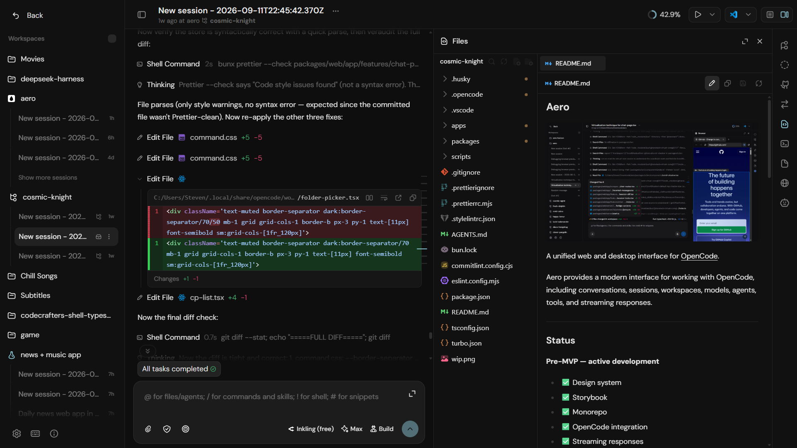

# Aero



> A unified interface for AI coding agents — one experience across web, CLI, and desktop.

Aero is an open-source interface layer for AI coding harnesses. Instead of learning a different workflow for every agent tool (`opencode`, `codex`, `claude`, and more), Aero provides a consistent environment for managing workspaces, conversations, tools, and agent workflows.

The idea is simple:

**AI harnesses will keep changing. The experience of working with them should not.**

---

## Vision

Aero aims to become the stable interface between developers and AI coding agents.

It provides:

- A modern chat-based interface for agent interaction
- A unified adapter system for different AI harnesses
- Web, CLI, and desktop experiences built on the same foundation
- Workspace and session management
- Reusable AI-focused UI components

---

## Current Status

Aero is currently in **pre-MVP development**.

The foundation is being built:

✅ Design system and UI components

✅ Storybook component reference

✅ Monorepo architecture

✅ Harness abstraction layer

🚧 Web MVP (currently in development)

⏳ CLI support

⏳ Desktop application

⏳ Additional harness integrations

The first milestone is a working web application powered by **opencode**.

---

## Architecture

Aero is structured as a modular monorepo:

```
apps/
  storybook      # UI component reference
  docs           # Documentation site

packages/
  ui             # Shared AI-first component library
  web            # Web application + Hono backend
  cli            # Future CLI interface
  desktop        # Future Electron desktop app
```

The core design principle:

```
Frontend
   ↓
Aero API Layer
   ↓
Harness Adapter
   ↓
AI Coding Agent
```

The UI should not care which harness powers the conversation underneath.

---

## Harness Support

Current focus:

- ✅ opencode (MVP target)

Future integrations:

- codex
- claude
- other AI coding harnesses

Adding a new harness should only require implementing Aero's adapter interface.

---

## Roadmap

### Phase 1 — Web MVP

- [x] Complete web application structure
- [x] Connect opencode adapter
- [x] Stream agent responses into Aero UI
- [x] Persist workspace and session state

### Phase 2 — Web Polish

- [ ] Storage improvements
- [ ] Settings system
- [ ] Error handling
- [ ] Better workspace management

### Phase 3 — CLI

- [ ] Reuse the same backend services
- [ ] Manage sessions from terminal

### Phase 4 — More Harnesses

- [ ] Add additional AI agent adapters

### Phase 5 — Desktop

- [ ] Electron application

---

## Tech Stack

- React
- TypeScript
- Vite
- Hono
- Tailwind CSS
- HeroUI
- Storybook
- Electron (planned)

---

## 📌 Project Status

**Pre-MVP — active development**

The design system is ready.
The application layer is being built.
